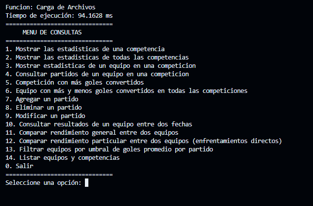

# Manual de Usuario - EQUIPAZZO

**EQUIPAZZO** es una aplicación para realizar consultas y gestionar datos de partidos de fútbol.

## Para comenzar...

Ejecute el programa con el siguiente comando en la terminal o ábralo directamente desde el navegador de archivos:

```bash
./main.exe
```

Se abrirá el menú principal en pantalla:



### Formato de datos

Los datos de los partidos están organizados en el siguiente orden:
- **Jornada**
- **Fecha** (formato: `DD/MM/YYYY`)
- **Equipo Local**
- **Goles Local**
- **Goles Visitante**
- **Equipo Visitante**
- **Competición**

**Ejemplo de un registro**:
```
Fase de Grupos - Partido 1, 18/09/2012, Málaga CF, 3, 0, Zenit, Champions League
```

### Opciones del menú principal
En el menú principal, verás una lista de opciones para realizar diversas consultas y operaciones sobre los datos de los partidos.

## Puntos importantes

### Jerarquía de datos
- **Competencia**: Torneo en el que compiten varios equipos en distintas fechas.
- **Jornada**: Número de la jornada o etapa del torneo.
- **Fecha**: Día en el que se juega el partido (formato: `DD/MM/YYYY`).

### Almacenamiento de datos
Los datos de los partidos (incluyendo aquellos que agregues, modifiques o elimines) se guardan en el archivo `Base_Datos_COMA.csv`. **No elimines este archivo** para evitar la pérdida de información.

### Consultas adicionales
Para consultar información sobre equipos y competencias, dirígete al punto 14 en el menú.

### Cierre del programa
Si necesitas cerrar el programa de manera forzada, utiliza la combinación de teclas **Ctrl+C**.

## Soporte
Para cualquier consulta o sugerencia, envíanos un correo a: [2315215@ucc.edu.ar](mailto:2315215@ucc.edu.ar)

--- 

